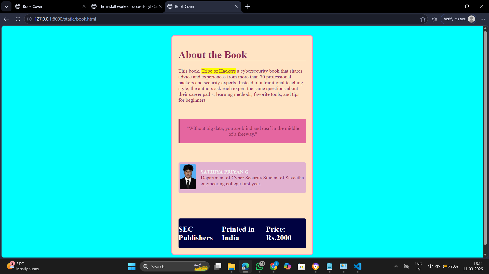

# Ex.05 Book Cover Page Design
## Date: 11.03.2026

## AIM:
To design a book back cover page using HTML and CSS.

## DESIGN STEPS:

### Step 1:
Create a Django Admin project.

### Step 2:
Create an app in the Django interface.

### Step 3:
Create a folder named 'static' in the app folder.

### Step 4:
Create a new HTML file in the static folder.

### Step 5:
Write the HTML code with relevant CSS properties.

### Step 6:
Choose the appropriate style and color scheme.

### Step 7:
Insert the images in their appropriate places.

### Step 8:
Publish the website in the LocalHost.

## PROGRAM
~~~

book.html

<html>
<head>
    <title>Book Cover</title>
    <link rel="stylesheet" href="style.css">
</head>
<body>

    <h1>About the Book</h1>
    
This book, <spam>Tribe of Hackers</spam> a cybersecurity book that shares advice and experiences from more than 70 professional hackers and security experts. Instead of a traditional teaching style, the authors ask each expert the same questions about their career paths, learning methods, favorite tools, and tips for beginners.

    

        "Without big data, you are blind and deaf in the middle of a freeway."
    

    

        
        

            <b>SATHIYA PRIYAN G</b> 
            Department of Cyber Security,Student of Saveetha engineering college first year.
        

    

    

        <h2>SEC Publishers</h2>
        <h2>Printed in India</h2>
        <h2>Price: Rs.2000</h2>
    

</body>
</html>

style.css

 body 
{
    background-color:cyan;
}
.box
{
    height: 650px;
    width: 400px;
    background-color: bisque;
    color: rgb(139, 45, 86);
    padding: 20px;
    margin: 30px auto;
    border: 3px solid rgb(255, 150, 194);
    border-radius: 10px;
}
.box h1
{
    border-bottom:2px solid rgb(139, 45, 86);
}
.box spam
{
    background:yellow;
}
.quote 
{
    background: rgb(229, 102, 160);
    padding: 20px;
    border-left: 5px solid rgb(164, 58, 97);
    margin: 50px 0;
    text-align: center;
 }

.author
{
    display: flex;
    gap: 15px;
    background: rgb(226, 178, 208);
    padding: 5px;
    margin-top: 60px;
    border-radius: 5px;
}
.author b
{
    color: rgb(243, 243, 243);
}
.author img
{
    width: 50px;
    height: 80px;
    border-radius: 5px;
}
.footer
{
    background: rgb(0, 2, 65);
    color: white;
    display: flex;
    justify-content: space-between;
    margin-top: 80px;
    border-radius: 5px;
}
~~~

## OUTPUT:

## RESULT:
The program for designing book back cover page using HTML and CSS is completed successfully.
